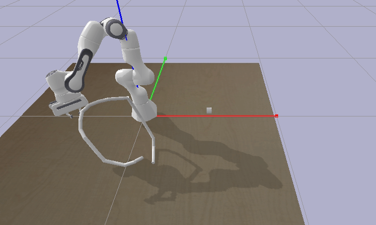
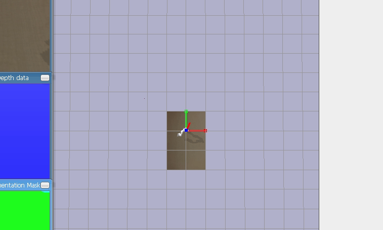

# peg-in-hole-gym

Gym env for multi-task simulation with kinds of robotic arms, engined by pybullet

## Task List

- peg-in-hole

  

- random-fly

  

- real-fly

- plug-in

## Features

- multi-agent in one simulation
- multi-simulation with multiprocessing
- alternative for kinds of robotic arms (panda and ur5)

## Installation

```bash
$ git clone git@github.com:guodashun/peg-in-hole-gym.git
$ cd peg-in-hole-gym
$ pip install -e .
```

## Usage

##### Initial the environment(e.g. random-fly)

```python
import gym
import pybullet as p
import peg_in_hole_gym

env = gym.make('peg-in-hole-mp-v0', client=p.GUI, task='random-fly', mp_num=mp_num, sub_num=sub_num, offset = [2.,3.,0.],args=['Banana', 1/120.], is_test=True)
env.reset()
env.render()
```

##### Perform a task

```python
obs = env.reset()
while True:
    obs, reward, done, info = env.step(env.action_space.sample())
	time.sleep(0.01)
```

## Reference

- [PyBullet Quickstart Guide](https://docs.google.com/document/d/10sXEhzFRSnvFcl3XxNGhnD4N2SedqwdAvK3dsihxVUA/edit?usp=sharing)

